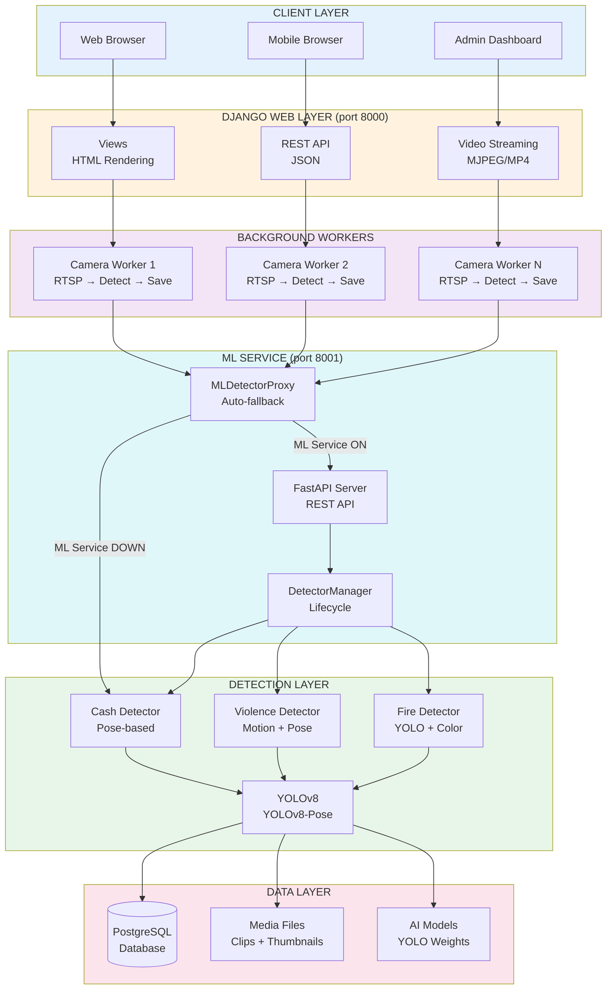
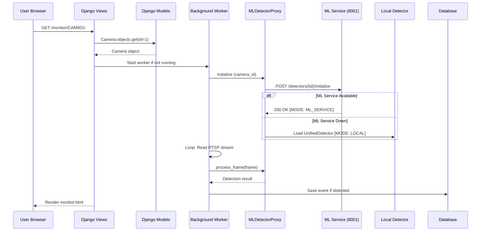
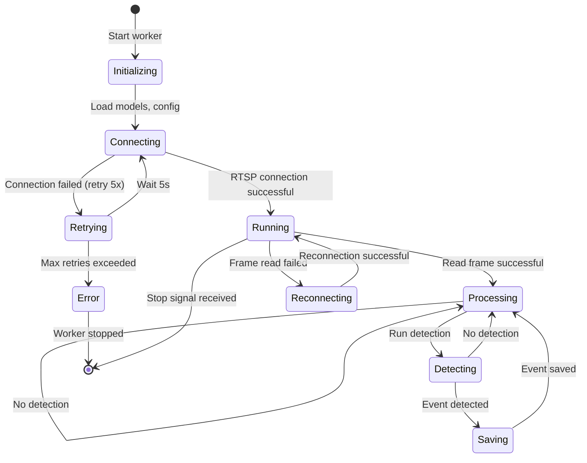
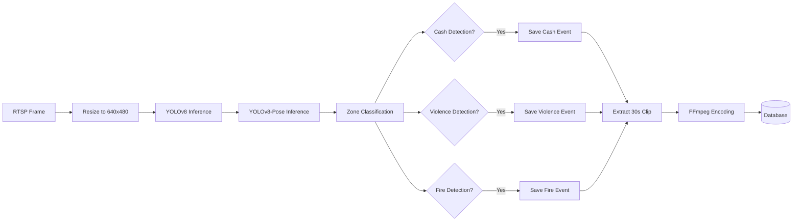
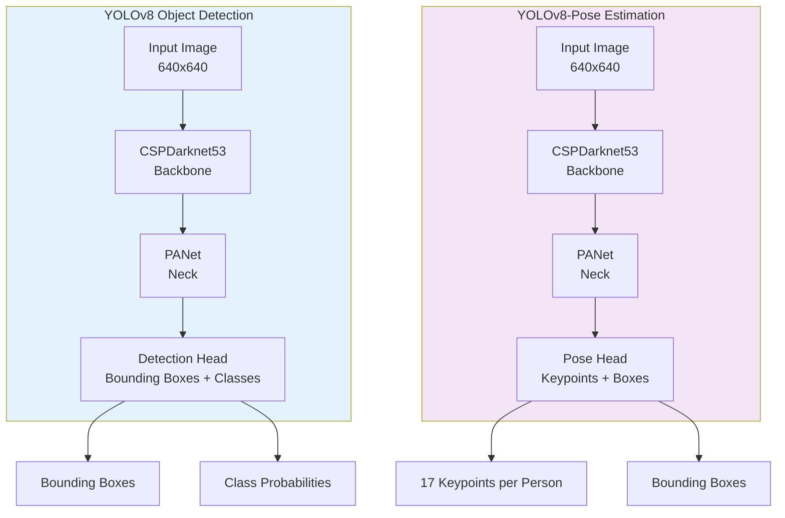
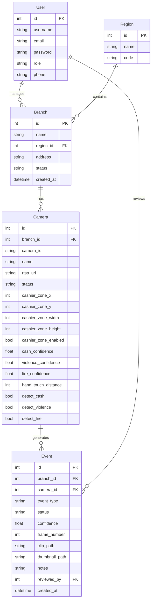

# Architecture - Hotel Cash Detector

Technical architecture and system design.

## Table of Contents

1. [High-Level Architecture](#high-level-architecture)
2. [Technology Stack](#technology-stack)
3. [Directory Structure](#directory-structure)
4. [Django Application Layers](#django-application-layers)
5. [Background Workers](#background-workers)
6. [Detection Pipeline](#detection-pipeline)
7. [AI Models](#ai-models)
8. [Video Processing](#video-processing)
9. [Database Architecture](#database-architecture)

---

## High-Level Architecture

The system follows a **microservice architecture** with a Django backend for web/API, a separate FastAPI ML service for AI detection, and background workers for real-time video processing.

### Microservice Overview

```
                    ┌─────────────────┐
                    │     Nginx       │
                    │   (port 80/443) │
                    └────────┬────────┘
                             │
              ┌──────────────┴──────────────┐
              │                             │
    ┌─────────▼─────────┐         ┌─────────▼─────────┐
    │  Django Backend    │  REST   │   ML Service      │
    │    (port 8000)     │◄───────►│   (port 8001)     │
    │                    │         │                   │
    │ - User auth        │         │ - UnifiedDetector │
    │ - Database ops     │         │ - CashDetector    │
    │ - Video streaming  │         │ - ViolenceDetector│
    │ - Event storage    │         │ - FireDetector    │
    │ - API endpoints    │         │ - GeminiValidator │
    └─────────┬──────────┘         └─────────┬─────────┘
              │                              │
    ┌─────────▼──────────┐         ┌─────────▼─────────┐
    │    PostgreSQL       │         │   GPU / Models    │
    └────────────────────┘         └───────────────────┘
```

### Detailed Architecture Diagram



**Architectural Patterns**:
- **Microservice Architecture**: Django backend + FastAPI ML service, communicating via REST API
- **Auto-Fallback**: `MLDetectorProxy` transparently falls back to local detection if ML service is down
- **Auto-Recovery**: Periodic reconnection attempts (every 100 frames) to ML service when running locally
- **Background Workers**: Independent threads per camera for concurrent processing
- **Event-Driven**: Detection events trigger asynchronous clip saving
- **Modular Detectors**: Cash, Violence, Fire detectors are independent, swappable modules

### Detection Mode Indicators

The system logs which detection mode is active for each camera:
- `[MODE: ML_SERVICE]` - Using remote ML service for detection
- `[MODE: LOCAL]` - Using local UnifiedDetector (fallback)
- `[MODE: ML_SERVICE -> LOCAL]` - ML service failed, switching to local
- `[MODE: ML_SERVICE] ML service recovered` - Switching back from local to ML service

---

## Technology Stack

### Backend Framework

| Component | Technology | Version | Purpose |
|-----------|------------|---------|---------|
| **Web Framework** | Django | 5.2.7 | MVC framework, ORM, admin panel |
| **ML Service** | FastAPI | Latest | AI detection microservice |
| **Python** | Python | 3.10+ | Core programming language |
| **WSGI Server** | Gunicorn | Latest | Production Django server |
| **ASGI Server** | Uvicorn | Latest | Production FastAPI server |
| **Threading** | Threading | Built-in | Background worker management |

### AI/ML Stack

| Component | Technology | Version | Purpose |
|-----------|------------|---------|---------|
| **Deep Learning** | PyTorch | 2.0+ | Model inference backend |
| **Object Detection** | Ultralytics YOLO | 8.0+ | Person, fire detection |
| **Pose Estimation** | YOLOv8-Pose | 8.0+ | Hand position tracking |
| **Computer Vision** | OpenCV | 4.8+ | Frame processing, video I/O |
| **Array Operations** | NumPy | 1.24+ | Numerical computations |
| **GPU Acceleration** | CUDA | 11.8/12.1 | GPU-accelerated inference |

**Model Inference Performance**:
- **CPU (i7)**: 150-200ms per frame
- **GPU (GTX 1660)**: 20-30ms per frame
- **GPU (RTX 3060)**: 15-20ms per frame

### Database

| Component | Technology | Purpose |
|-----------|------------|---------|
| **Development** | SQLite3 | Local development, zero config |
| **Production** | PostgreSQL 16 | High-performance, concurrent access |
| **ORM** | Django ORM | Database abstraction |
| **Migrations** | Django Migrations | Schema versioning |

### Video Processing

| Component | Technology | Purpose |
|-----------|------------|---------|
| **Stream Protocol** | RTSP over TCP | Camera connection (reliable) |
| **Video Codec** | H.264 (libx264) | Clip encoding |
| **Transcoding** | FFmpeg | Video conversion to web format |
| **Container** | MP4 (faststart) | Web-compatible streaming |

---

## Directory Structure

```
Hotel-Cash-Detector/
├── manage.py                      # Django management script
├── .env                           # Environment variables
├── docker-compose.yml             # Docker Compose (all services)
├── update_server.sh               # Server deployment script
│
├── hotel_cctv/                    # Django project settings
│   ├── settings.py                # Configuration
│   ├── urls.py                    # Root URL routing
│   ├── wsgi.py                    # WSGI entry point (Gunicorn)
│   └── asgi.py                    # ASGI entry point
│
├── cctv/                          # Main CCTV application
│   ├── models.py                  # Database models (User, Camera, Event)
│   ├── views.py                   # Views, API endpoints, BackgroundWorker
│   ├── ml_client.py               # ML Service client + MLDetectorProxy
│   ├── urls.py                    # App URL routing
│   ├── admin.py                   # Admin panel configuration
│   ├── translations.py            # Multi-language support (EN/KO/TH/VI/ZH)
│   └── context_processors.py      # Template context (language, user)
│
├── detectors/                     # Detection modules (used by Django local fallback)
│   ├── __init__.py                # Exports + get_device() + get_device_info()
│   ├── base_detector.py           # BaseDetector abstract class
│   ├── unified_detector.py        # UnifiedDetector
│   ├── cash_detector.py           # CashDetector (pose-based)
│   ├── violence_detector.py       # ViolenceDetector (motion + pose)
│   ├── fire_detector.py           # FireDetector (YOLO + color)
│   └── gemini_validator.py        # Gemini AI validation
│
├── ml_service/                    # FastAPI ML Microservice
│   ├── app/
│   │   ├── __init__.py
│   │   ├── main.py                # FastAPI entry point
│   │   ├── config.py              # ML service settings
│   │   ├── models/
│   │   │   └── schemas.py         # Pydantic request/response models
│   │   ├── api/
│   │   │   └── routes.py          # API endpoints
│   │   └── services/
│   │       └── detector_manager.py # Detector lifecycle management
│   ├── detectors/                 # Copied from root detectors/
│   │   ├── __init__.py            # Includes get_device() + get_device_info()
│   │   ├── base_detector.py
│   │   ├── unified_detector.py
│   │   ├── cash_detector.py
│   │   ├── violence_detector.py
│   │   ├── fire_detector.py
│   │   └── gemini_validator.py
│   ├── requirements.txt           # ML service dependencies
│   └── Dockerfile                 # ML service container
│
├── templates/cctv/                # HTML templates
│   ├── base.html                  # Base template (navigation, footer)
│   ├── home.html                  # Dashboard (region/branch overview)
│   ├── monitor_all.html           # Multi-camera live view
│   ├── monitor_local.html         # Single camera with debug overlay
│   ├── camera_settings.html       # Camera configuration UI
│   └── video_logs.html            # Event logs with filters
│
├── static/                        # Static assets
│   ├── css/style.css              # Dark theme styles
│   └── js/main.js                 # Interactive components
│
├── media/                         # User-generated content
│   ├── clips/                     # Event video clips (30s MP4)
│   ├── thumbnails/                # Event thumbnails (JPG)
│   └── json/                      # Event metadata (JSON)
│
├── models/                        # AI model weights
│   ├── yolov8s.pt                 # YOLOv8 Small (person detection)
│   ├── yolov8s-pose.pt            # YOLOv8 Pose (hand tracking)
│   └── fire_smoke_yolov8.pt       # Fire/smoke detection
│
├── docs/                          # Documentation
│   ├── 00-overview.md
│   ├── 01-architecture.md
│   └── ...
│
└── nginx/                         # Nginx configuration
    └── nginx.conf                 # Reverse proxy config
```

**Key Design Decisions**:
- **Microservice Separation**: ML detectors run in a separate FastAPI service for independent scaling
- **Auto-Fallback**: `MLDetectorProxy` in `cctv/ml_client.py` handles ML service ↔ local detector switching
- **Duplicated Detectors**: `ml_service/detectors/` is a copy of root `detectors/` for ML service independence
- **Media Separation**: Clips, thumbnails, JSON kept separate for easy backup/cleanup
- **Template-Based UI**: Server-side rendering for simplicity and SEO
- **Static Models**: Model weights stored locally (no runtime downloads in production)

---

## Django Application Layers

### Request Flow



### URL Routing

**Key Routes**:

| URL | View | Purpose |
|-----|------|---------|
| `/` | `home` | Dashboard (region/branch overview) |
| `/monitor/all/` | `monitor_all_cameras` | Multi-camera live view |
| `/monitor/<camera_id>/` | `monitor_local` | Single camera with debug |
| `/camera/<camera_id>/settings/` | `camera_settings` | Configuration UI |
| `/video-logs/` | `video_logs` | Event logs with filters |
| `/api/stream/<camera_id>/` | `stream_camera` | MJPEG live stream |
| `/api/workers/status/` | `workers_status` | Worker status JSON |
| `/api/pms/sync-project/` | `pms_sync_project` | PMS integration webhook |
| `/admin/` | Django Admin | Database management |

### Template Rendering

**Template Inheritance**:
```
base.html (navigation, footer, language switcher)
    ├── home.html (dashboard)
    ├── monitor_all.html (multi-camera grid)
    ├── monitor_local.html (single camera + debug)
    ├── camera_settings.html (configuration form)
    └── video_logs.html (event table + filters)
```

**Context Processors**:
- `get_current_language`: Injects current language code into templates
- `user_context`: Injects user role and permissions

---

## Background Workers

### BackgroundCameraWorker

Each camera runs an independent background thread with the following lifecycle:



**Worker Responsibilities**:
1. **RTSP Stream Management**:
   - Connect to RTSP URL with TCP transport
   - Retry on failure (5 attempts, 5s delay)
   - Automatic reconnection on stream loss
   - Frame buffering (last 30 seconds in memory)

2. **Frame Processing**:
   - Read frames at camera FPS (25-30 typical)
   - Pass to UnifiedDetector for detection
   - Track frame number for clip extraction

3. **Event Handling**:
   - Trigger on detection (cash, violence, fire)
   - Respect cooldown periods (prevent duplicates)
   - Asynchronous clip saving (non-blocking)

4. **Status Reporting**:
   - Uptime tracking
   - Frame count
   - Event count
   - Last error message
   - Connection status

**Worker Configuration** (per camera):
```python
# In Camera model
detect_cash = True           # Enable cash detection
detect_violence = True       # Enable violence detection
detect_fire = True           # Enable fire detection
cash_confidence = 0.5        # Detection threshold
hand_touch_distance = 100    # Max pixel distance for cash
```

---

## Detection Pipeline

### Frame Processing Flow



### MLDetectorProxy (Primary)

When `USE_ML_SERVICE=True`, the **MLDetectorProxy** is used as a drop-in replacement for `UnifiedDetector`. It delegates frame processing to the ML service via HTTP and automatically falls back to a local detector if the service goes down.

```python
class MLDetectorProxy:
    RECONNECT_CHECK_INTERVAL = 100  # Check ML service every 100 frames

    def __init__(self, config, camera_id):
        self.client = MLServiceClient()       # HTTP client for ML service
        self._using_ml_service = False         # Mode flag
        self._local_detector = None            # Fallback detector
        self._initialize_remote()              # Try ML service first

    def process_frame(self, frame, draw_overlay=True):
        # Periodic reconnect check when running locally
        if not self._using_ml_service and frames >= RECONNECT_CHECK_INTERVAL:
            self._try_reconnect_ml_service()

        if self._using_ml_service:
            try:
                return self.client.process_frame(...)  # ML service call
            except Exception:
                self._using_ml_service = False
                self._load_local_detector()            # Auto-fallback

        return self._local_detector.process_frame(frame, draw_overlay)
```

### UnifiedDetector (Fallback / Local Mode)

**Main Detector Class** that coordinates all detection types locally:

```python
class UnifiedDetector:
    def __init__(self, config):
        self.device = 'cuda' if torch.cuda.is_available() else 'cpu'

        # Load AI models
        self.yolo_model = YOLO('models/yolov8s.pt').to(self.device)
        self.pose_model = YOLO('models/yolov8s-pose.pt').to(self.device)
        self.fire_model = YOLO('models/fire_smoke_yolov8.pt').to(self.device)

        # Initialize detectors
        self.cash_detector = CashDetector(config)
        self.violence_detector = ViolenceDetector(config)
        self.fire_detector = FireDetector(config)

    def process_frame(self, frame):
        """Process single frame through all enabled detectors."""
        # Run YOLO inference once for efficiency
        yolo_results = self.yolo_model(frame, device=self.device, verbose=False)
        pose_results = self.pose_model(frame, device=self.device, verbose=False)

        # Run enabled detectors...
        return results
```

**Performance Optimization**:
- **Single YOLO Pass**: Run YOLOv8 once, reuse results for all detectors
- **Conditional Detection**: Skip disabled detectors
- **GPU Batching**: Process multiple frames in batch (if GPU memory allows)
- **Frame Skipping**: Process every Nth frame if CPU/GPU limited

---

## AI Models

### Model Architecture



### YOLOv8-Pose Keypoints

**17 Keypoint COCO Format**:

| Index | Keypoint | Used For |
|-------|----------|----------|
| 0 | nose | Person identification |
| 1-2 | eyes | Face detection |
| 3-4 | ears | Face orientation |
| 5 | left_shoulder | Center point calculation |
| 6 | right_shoulder | Center point calculation |
| 7-8 | elbows | Arm position (violence) |
| **9** | **left_wrist** | **Cash detection (hand)** |
| **10** | **right_wrist** | **Cash detection (hand)** |
| 11 | left_hip | Center point calculation |
| 12 | right_hip | Center point calculation |
| 13-14 | knees | Pose classification |
| 15-16 | ankles | Pose classification |

**Keypoint Extraction**:
```python
for result in pose_results:
    keypoints = result.keypoints.xy.cpu().numpy()  # Shape: (N, 17, 2)

    for person_kp in keypoints:
        left_wrist = person_kp[9]   # (x, y)
        right_wrist = person_kp[10]  # (x, y)

        # Calculate center point
        left_hip = person_kp[11]
        right_hip = person_kp[12]
        center = ((left_hip[0] + right_hip[0]) / 2,
                  (left_hip[1] + right_hip[1]) / 2)
```

### Model Performance

| Model | Inference Time (GPU) | Inference Time (CPU) | Accuracy | Use Case |
|-------|---------------------|---------------------|----------|----------|
| **YOLOv8s** | ~20ms | ~150ms | Better | Default (person detection) |
| **YOLOv8s-Pose** | ~25ms | ~200ms | Better | Default (hand tracking) |
| **YOLOv8n** | ~15ms | ~100ms | Good | Low-resource systems |
| **YOLOv8n-Pose** | ~18ms | ~120ms | Good | Low-resource systems |
| **Fire/Smoke YOLO** | ~10ms | ~80ms | Custom-trained | Fire detection |

**GPU Memory Usage**:
- YOLOv8s: ~500MB per camera
- YOLOv8n: ~300MB per camera

---

## Video Processing

### RTSP Stream Configuration

**OpenCV FFmpeg Options**:
```python
import os
import cv2

os.environ['OPENCV_FFMPEG_CAPTURE_OPTIONS'] = (
    'rtsp_transport;tcp|'              # TCP (reliable, firewalls)
    'stimeout;60000000|'                # 60s socket timeout
    'max_delay;1000000|'                # 1s max frame delay
    'fflags;nobuffer+discardcorrupt|'  # Low latency
    'analyzeduration;2000000|'          # 2s to analyze stream
    'probesize;2000000|'                # 2MB probe size
    'buffer_size;4096000'               # 4MB network buffer
)

cap = cv2.VideoCapture(rtsp_url, cv2.CAP_FFMPEG)
cap.set(cv2.CAP_PROP_OPEN_TIMEOUT_MSEC, 30000)  # 30s connection
cap.set(cv2.CAP_PROP_READ_TIMEOUT_MSEC, 15000)  # 15s read
cap.set(cv2.CAP_PROP_BUFFERSIZE, 5)             # 5 frames
```

### Clip Saving Pipeline

**30-Second Clip Extraction**:

```python
# Frame buffer (30 seconds at 30fps = 900 frames)
frame_buffer = deque(maxlen=900)

while running:
    ret, frame = cap.read()
    frame_buffer.append((frame_number, frame))

    # Detection triggered
    if detection_event:
        # Extract 15s before, 15s after detection
        clip_frames = list(frame_buffer)

        # Save asynchronously
        threading.Thread(target=save_clip, args=(clip_frames,)).start()
```

**FFmpeg Encoding**:
```bash
ffmpeg -y -f rawvideo -pix_fmt bgr24 -s 1920x1080 -r 30 -i - \
  -c:v libx264 -preset fast -crf 23 \
  -movflags +faststart \
  -t 30 \
  media/clips/event_123_clip.mp4
```

**Encoding Parameters**:
- **Codec**: H.264 (libx264) - Universal browser support
- **Preset**: `fast` - Balance between speed and compression
- **CRF**: 23 - Constant Rate Factor (18-28 typical, lower = better quality)
- **movflags +faststart**: Move metadata to start for web streaming

---

## Database Architecture

### Entity-Relationship Diagram



### Index Strategy

**Critical Indexes**:
```sql
-- Camera queries by branch
CREATE INDEX idx_camera_branch ON cctv_camera(branch_id);

-- Event queries by camera and date
CREATE INDEX idx_event_camera ON cctv_event(camera_id);
CREATE INDEX idx_event_created ON cctv_event(created_at DESC);

-- Event filtering by type and status
CREATE INDEX idx_event_type_status ON cctv_event(event_type, status);

-- User branch management
CREATE INDEX idx_branch_region ON cctv_branch(region_id);
```

**Query Optimization**:
```python
# Efficient event query with indexes
events = Event.objects.filter(
    camera__branch__region_id=region_id,
    event_type='cash',
    created_at__gte=start_date
).select_related('camera', 'branch', 'reviewed_by').order_by('-created_at')
```

---

## Related Documentation

- [00 - Overview](00-overview.md) - System overview and features
- [02 - Setup](02-setup.md) - Development setup
- [04 - Features](04-features.md) - Detection algorithms in detail
- [05 - Data Models](05-data-models.md) - Database schema
- [06 - Integrations](06-integrations.md) - PMS, RTSP, GPU integration

---

**Previous**: [← 00 - Overview](00-overview.md) | **Next**: [02 - Setup →](02-setup.md)
