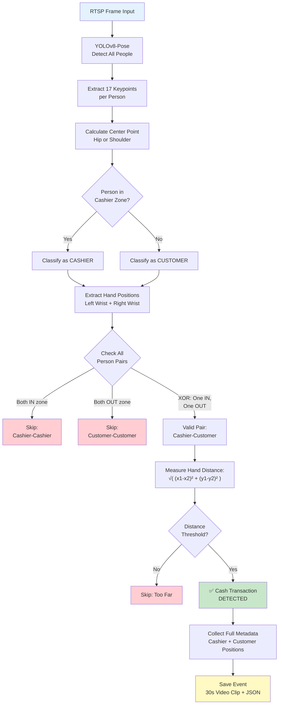
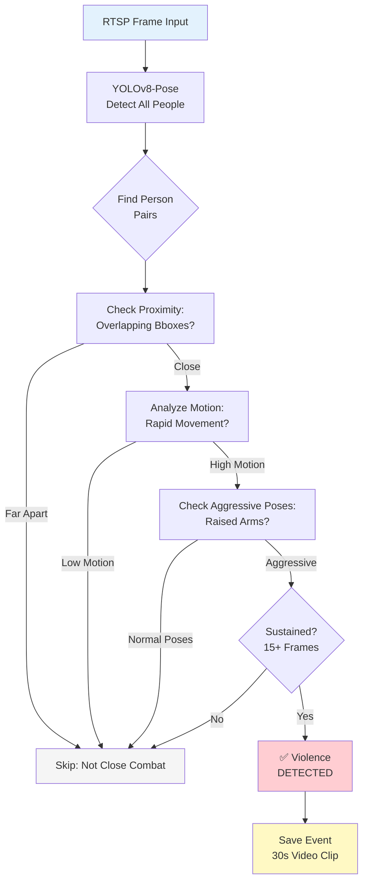
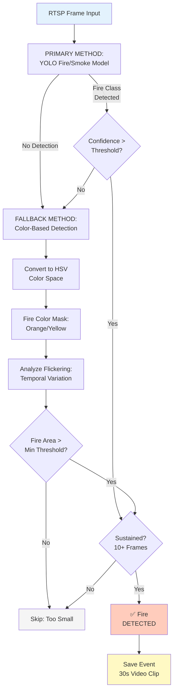
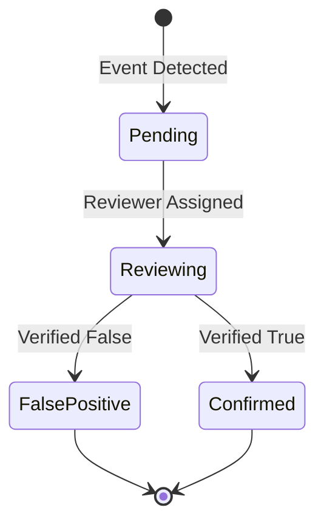

# Features - Hotel Cash Detector

Detailed documentation of all detection features and algorithms.

## Table of Contents

1. [Cash Transaction Detection](#cash-transaction-detection)
2. [Violence Detection](#violence-detection)
3. [Fire/Smoke Detection](#firesmoke-detection)
4. [Developer Mode](#developer-mode)
5. [Multi-Language Support](#multi-language-support)
6. [Event Management](#event-management)

---

## Cash Transaction Detection

### Overview

**Purpose**: Detect hand-to-hand exchanges between cashier and customer at hotel front desk.

**Algorithm**: Pose-based hand proximity detection with strict cashier-customer validation.

**Key Innovation**: Uses person CENTER POINT classification (not bounding box overlap) to prevent false positives.

---

### Detection Pipeline



---

### Detection Algorithm (Step-by-Step)

#### 1. Pose Estimation

**YOLOv8-Pose** detects all people in frame and extracts 17 keypoints per person.

```python
pose_results = pose_model(frame, device='cuda', verbose=False)

for result in pose_results:
    keypoints = result.keypoints.xy.cpu().numpy()  # Shape: (N, 17, 2)
    boxes = result.boxes.xyxy.cpu().numpy()        # Shape: (N, 4)
```

**Keypoints** (COCO Format):

| Index | Keypoint | Purpose |
|-------|----------|---------|
| 0 | nose | Person identification |
| 5 | left_shoulder | Center point calculation |
| 6 | right_shoulder | Center point calculation |
| **9** | **left_wrist** | **Hand detection (cash)** |
| **10** | **right_wrist** | **Hand detection (cash)** |
| 11 | left_hip | Center point calculation |
| 12 | right_hip | Center point calculation |

---

#### 2. Center Point Calculation

**Critical**: Use CENTER POINT (not bounding box overlap) for zone classification.

```python
def get_person_center(keypoints, bbox):
    """Calculate person center point from keypoints."""

    # Priority 1: Hip center (most stable)
    left_hip = keypoints[11]   # (x, y)
    right_hip = keypoints[12]

    if left_hip[0] > 0 and right_hip[0] > 0:  # Both hips visible
        center_x = (left_hip[0] + right_hip[0]) / 2
        center_y = (left_hip[1] + right_hip[1]) / 2
        return (center_x, center_y)

    # Priority 2: Shoulder center
    left_shoulder = keypoints[5]
    right_shoulder = keypoints[6]

    if left_shoulder[0] > 0 and right_shoulder[0] > 0:
        center_x = (left_shoulder[0] + right_shoulder[0]) / 2
        center_y = (left_shoulder[1] + right_shoulder[1]) / 2
        return (center_x, center_y)

    # Fallback: Bounding box center
    x1, y1, x2, y2 = bbox
    return ((x1 + x2) / 2, (y1 + y2) / 2)
```

**Why Hip/Shoulder Center?**
- More stable than bbox (bbox can split zones)
- Represents true body position
- Prevents ambiguous classifications

---

#### 3. Zone Classification (STRICT)

Classify each person as CASHIER or CUSTOMER based on center point.

```python
def is_in_cashier_zone(self, center):
    """Check if center point is inside cashier zone."""
    if not self.camera.cashier_zone_enabled:
        return False

    cx, cy = center
    zx = self.camera.cashier_zone_x
    zy = self.camera.cashier_zone_y
    zw = self.camera.cashier_zone_width
    zh = self.camera.cashier_zone_height

    # Point-in-rectangle check
    return (zx <= cx <= zx + zw) and (zy <= cy <= zy + zh)
```

**Result**:
- `in_cashier_zone = True`: CASHIER
- `in_cashier_zone = False`: CUSTOMER

**One person = ONE classification** (no ambiguity).

---

#### 4. Hand Position Extraction

Extract hand (wrist) positions from keypoints.

```python
def extract_hands(keypoints):
    """Extract left and right hand positions."""
    left_wrist = keypoints[9]   # (x, y)
    right_wrist = keypoints[10]  # (x, y)

    hands = {}

    # Only use if confidence >= 0.3 (visible)
    if left_wrist[0] > 0:
        hands['left'] = left_wrist

    if right_wrist[0] > 0:
        hands['right'] = right_wrist

    return hands
```

**Requirements**:
- Wrist must be visible (not occluded)
- Keypoint confidence >= 0.3

---

#### 5. Hand Proximity Check (STRICT XOR VALIDATION)

**Critical**: Only check hand distance for CASHIER-CUSTOMER pairs (XOR validation).

```python
def detect_cash_transaction(people):
    """Detect cash transaction between cashier and customer."""

    for i, person1 in enumerate(people):
        for j, person2 in enumerate(people[i+1:], start=i+1):

            p1_in = person1['in_cashier_zone']
            p2_in = person2['in_cashier_zone']

            # STRICT XOR: Exactly ONE in zone, ONE outside
            is_valid_pair = (p1_in and not p2_in) or (not p1_in and p2_in)

            if not is_valid_pair:
                continue  # Skip: both cashiers OR both customers

            # Valid cashier-customer pair
            cashier = person1 if p1_in else person2
            customer = person2 if p1_in else person1

            # Check all hand combinations
            for cashier_hand in ['left', 'right']:
                for customer_hand in ['left', 'right']:

                    if cashier_hand not in cashier['hands']:
                        continue
                    if customer_hand not in customer['hands']:
                        continue

                    # Calculate distance
                    c_hand = cashier['hands'][cashier_hand]
                    cust_hand = customer['hands'][customer_hand]

                    distance = math.sqrt(
                        (c_hand[0] - cust_hand[0])**2 +
                        (c_hand[1] - cust_hand[1])**2
                    )

                    # Check threshold
                    if distance < self.camera.hand_touch_distance:
                        return {
                            'detected': True,
                            'cashier': cashier,
                            'customer': customer,
                            'distance': distance,
                            'threshold': self.camera.hand_touch_distance,
                            'cashier_hand_used': cashier_hand,
                            'customer_hand_used': customer_hand
                        }

    return {'detected': False}
```

**XOR Logic**:
- ✅ Cashier (IN) + Customer (OUT) → **Valid**
- ❌ Cashier (IN) + Cashier (IN) → **Skip**
- ❌ Customer (OUT) + Customer (OUT) → **Skip**

---

#### 6. Detection Criteria (ALL Must Be True)

| Criterion | Description | Check |
|-----------|-------------|-------|
| **Zone XOR** | ONE person IN zone, ONE OUT | `(p1_in XOR p2_in)` |
| **Hand Visibility** | Both people have visible hands | Confidence >= 0.3 |
| **Hand Distance** | Hands are close enough | `distance < threshold` |
| **Consecutive Frames** | Sustained detection | `count >= min_transaction_frames` |
| **Cooldown** | Sufficient time since last event | `elapsed >= transaction_cooldown` |

**All conditions must be TRUE for event to trigger.**

---

#### 7. Metadata Collection

**Comprehensive metadata** is collected for every detection:

```json
{
  "event_type": "cash",
  "confidence": 0.87,

  "cashier": {
    "center": [640, 540],
    "bbox": [520, 380, 760, 700],
    "hands": {
      "left": [580, 460, 0.92],
      "right": [695, 455, 0.88]
    },
    "in_zone": true,
    "hand_used": "right"
  },

  "customer": {
    "center": [920, 510],
    "bbox": [820, 350, 1020, 670],
    "hands": {
      "left": [865, 445, 0.85],
      "right": [975, 520, 0.79]
    },
    "in_zone": false,
    "hand_used": "left"
  },

  "measured_hand_distance": 85.5,
  "distance_threshold": 100,
  "interaction_point": [780, 450],
  "people_count": 2
}
```

**Stored In**:
- Database: `Event` model
- JSON file: `media/json/cash_<camera_id>_<timestamp>.json`
- Video clip: 30-second MP4 with detection overlay

---

### Key Parameters

Configurable via `.env` or Camera Settings:

| Parameter | Default | Range | Purpose |
|-----------|---------|-------|---------|
| `CASH_DETECTION_CONFIDENCE` | 0.5 | 0.3-0.8 | Pose confidence threshold |
| `HAND_TOUCH_DISTANCE` | 100 | 60-200 | Max pixels between hands |
| `MIN_TRANSACTION_FRAMES` | 1 | 1-5 | Consecutive frames required |
| `TRANSACTION_COOLDOWN` | 45 | 30-90 | Frames between events (1-3s at 30fps) |

**Tuning Guide**:
- **1080p camera**: `HAND_TOUCH_DISTANCE=120-150`
- **720p camera**: `HAND_TOUCH_DISTANCE=80-100`
- **More false positives**: Increase confidence or distance threshold
- **Missing detections**: Decrease thresholds

---

### Key Improvements (December 2025)

#### 1. Center Point Classification (vs. Bbox Overlap)

**OLD Method** (Ambiguous):
```python
# Problem: 30% overlap = ambiguous classification
if self.is_box_in_cashier_zone(bbox, threshold=0.3):
    # Person bbox partially overlaps zone
    # Could be classified as BOTH cashier AND customer
```

**NEW Method** (Definitive):
```python
# One person = one center point = one classification
center = self.get_person_center(keypoints, bbox)
if self.is_in_cashier_zone(center):
    # Cashier (no ambiguity)
else:
    # Customer (no ambiguity)
```

#### 2. Strict XOR Validation

```python
# Enforce cashier-customer pairs ONLY
p1_in = person1['in_cashier_zone']
p2_in = person2['in_cashier_zone']
is_valid_pair = (p1_in and not p2_in) or (not p1_in and p2_in)

if not is_valid_pair:
    continue  # Skip: both cashiers OR both customers
```

**Result**: No more false positives from cashier-cashier or customer-customer interactions.

---

## Violence Detection

### Overview

**Purpose**: Detect physical altercations or aggressive behavior in hotel areas.

**Algorithm**: Pose-based close combat detection with motion analysis.

---

### Detection Pipeline



---

### Detection Criteria

**All conditions must be TRUE**:

| Criterion | Check | Purpose |
|-----------|-------|---------|
| **Close Proximity** | Bounding boxes overlap | Physical altercation |
| **Multiple People** | 2+ people detected | Violence requires 2+ people |
| **Aggressive Poses** | Raised arms, rapid motion | Indicates aggression |
| **High Motion** | Motion magnitude > threshold | Rapid movement |
| **Sustained Detection** | 15+ consecutive frames | Not momentary motion |
| **Confidence** | Score >= threshold | Reduce false positives |

---

### Key Parameters

| Parameter | Default | Range | Purpose |
|-----------|---------|-------|---------|
| `VIOLENCE_DETECTION_CONFIDENCE` | 0.6 | 0.5-0.8 | Detection threshold |
| `MIN_VIOLENCE_FRAMES` | 15 | 10-20 | Consecutive frames (0.5s at 30fps) |
| `MOTION_THRESHOLD` | 100 | 80-150 | Motion magnitude threshold |
| `VIOLENCE_COOLDOWN` | 90 | 60-120 | Frames between alerts (3s at 30fps) |

---

### Exclusions

**Violence detector IGNORES**:
- Single person actions (not violence)
- Cashier zone (normal transactions)
- Slow movements (walking, gesturing)

---

## Fire/Smoke Detection

### Overview

**Purpose**: Detect fire and smoke for early safety alerts.

**Algorithm**: YOLO + Color-based detection with flickering analysis.

---

### Detection Pipeline



---

### Primary Method: YOLO Fire/Smoke Model

**Custom-trained YOLOv8 model** for fire and smoke detection.

**Classes**:
- `0`: Fire
- `1`: default (background)
- `2`: Smoke

**Usage**:
```python
fire_results = fire_model(frame, conf=0.25, device='cuda')

for result in fire_results:
    boxes = result.boxes
    for box in boxes:
        cls = int(box.cls[0])
        conf = float(box.conf[0])

        if cls == 0 and conf >= camera.fire_confidence:
            # Fire detected
            return {'detected': True, 'method': 'yolo', 'confidence': conf}
```

---

### Fallback Method: Color-Based Detection

**If YOLO doesn't detect** or low confidence, use color-based fallback.

**Fire Color Detection (HSV)**:

```python
# Fire colors (bright orange/yellow)
fire_lower1 = np.array([5, 150, 200])    # Orange
fire_upper1 = np.array([25, 255, 255])

fire_lower2 = np.array([0, 200, 220])    # Red-orange
fire_upper2 = np.array([5, 255, 255])

# Create mask
hsv = cv2.cvtColor(frame, cv2.COLOR_BGR2HSV)
mask1 = cv2.inRange(hsv, fire_lower1, fire_upper1)
mask2 = cv2.inRange(hsv, fire_lower2, fire_upper2)
fire_mask = cv2.bitwise_or(mask1, mask2)

# Exclude skin tones (prevent false positives)
skin_lower = np.array([0, 20, 70])
skin_upper = np.array([25, 170, 200])
skin_mask = cv2.inRange(hsv, skin_lower, skin_upper)
fire_mask = cv2.bitwise_and(fire_mask, cv2.bitwise_not(skin_mask))

# Check fire area
fire_area = cv2.countNonZero(fire_mask)
if fire_area >= camera.min_fire_area:
    return {'detected': True, 'method': 'color_based', 'area': fire_area}
```

---

### Smoke Detection

**Background Subtraction + Color Mask**:

```python
# MOG2 background subtractor
bg_subtractor = cv2.createBackgroundSubtractorMOG2()
fg_mask = bg_subtractor.apply(frame)

# Smoke color (gray/white)
smoke_lower = np.array([0, 0, 150])
smoke_upper = np.array([180, 30, 255])
smoke_mask = cv2.inRange(hsv, smoke_lower, smoke_upper)

# Combine masks
smoke_detection = cv2.bitwise_and(fg_mask, smoke_mask)
smoke_area = cv2.countNonZero(smoke_detection)

if smoke_area >= min_smoke_area:
    return {'detected': True, 'type': 'smoke', 'area': smoke_area}
```

---

### Key Parameters

| Parameter | Default | Range | Purpose |
|-----------|---------|-------|---------|
| `FIRE_DETECTION_CONFIDENCE` | 0.5 | 0.4-0.7 | YOLO detection threshold |
| `MIN_FIRE_FRAMES` | 10 | 5-15 | Consecutive frames required |
| `MIN_FIRE_AREA` | 3000 | 2000-5000 | Minimum fire region (pixels²) |
| `FIRE_COOLDOWN` | 60 | 45-90 | Frames between alerts (2s at 30fps) |

---

## Developer Mode

### Overview

**Purpose**: Real-time detection visualization and threshold tuning for debugging.

**Access**: Password-protected developer panel in Camera Settings.

---

### Features

#### 1. Pose Overlay

**Visual Indicators**:
- **Person Bounding Boxes**:
  - Green: Cashier (IN zone)
  - Orange: Customer (OUT of zone)
- **Center Point Marker**: "C" at person center
- **Hand Circles**: Magenta circles at wrists (left/right)
- **Distance Lines** between hands:
  - **Green**: Valid detection (cashier-customer, close)
  - **Gray**: Ignored (cashier-cashier or customer-customer)
  - **Red**: Too far apart
- **Distance Labels**: Pixel values displayed

#### 2. Detection Info Panel

**Real-Time Logs**:
```
[CASH] Cashier (ID 0) IN zone at (640, 360)
[CASH] Customer (ID 1) OUT zone at (1000, 400)
[CASH] Hand distance: 87.3px (threshold: 100px) ✅ DETECTED
[EVENT] Saving event: cash transaction, confidence 0.82
```

#### 3. Threshold Tuning

**Live Adjustment**:
- Hand touch distance slider
- Confidence threshold slider
- See immediate effect on detection overlay

---

### Accessing Developer Mode

**Steps**:
1. Navigate to **Camera Settings** for a camera
2. Click **"Developer"** button
3. Enter password: `dev123`
4. Enable features:
   - ☑ Show Pose Overlay
   - ☑ Detection Info Logs
   - ☑ Live Threshold Tuning

---

## Multi-Language Support

### Supported Languages

| Code | Language | Coverage |
|------|----------|----------|
| `en` | English | Default |
| `ko` | Korean | Full (UI + labels) |
| `th` | Thai | Full |
| `vi` | Vietnamese | Full |
| `zh` | Chinese | Full |

### Language Switching

**UI Switcher**:
- Top-right corner of every page
- Dropdown menu: EN | KO | TH | VI | ZH
- Persists in session cookie

**Implementation**:
```python
# cctv/translations.py
TRANSLATIONS = {
    'en': {
        'cash': 'Cash Transaction',
        'fire': 'Fire',
        'violence': 'Violence/Disturbance'
    },
    'ko': {
        'cash': '현금',
        'fire': '화재',
        'violence': '난동'
    },
    # ... other languages
}
```

---

## Event Management

### Event Lifecycle



### Event Status

| Status | Description | Next Actions |
|--------|-------------|--------------|
| **pending** | Just detected, not reviewed | Assign reviewer |
| **reviewing** | Under review | Confirm or mark false positive |
| **confirmed** | Verified as real event | Archive or delete |
| **false_positive** | Not a real event | Archive or delete |

### Event Data

**Each event includes**:
- 30-second video clip (MP4)
- Thumbnail image (JPG)
- JSON metadata (full detection info)
- Database record with:
  - Timestamp
  - Camera and branch
  - Event type (cash/violence/fire)
  - Confidence score
  - Reviewer notes

---

## Related Documentation

- [00 - Overview](00-overview.md) - System overview
- [01 - Architecture](01-architecture.md) - Technical architecture
- [03 - Environment Variables](03-env.md) - Parameter configuration
- [05 - Data Models](05-data-models.md) - Database schema
- [06 - Integrations](06-integrations.md) - PMS, RTSP, GPU integration

---

**Previous**: [← 03 - Environment Variables](03-env.md) | **Next**: [05 - Data Models →](05-data-models.md)
