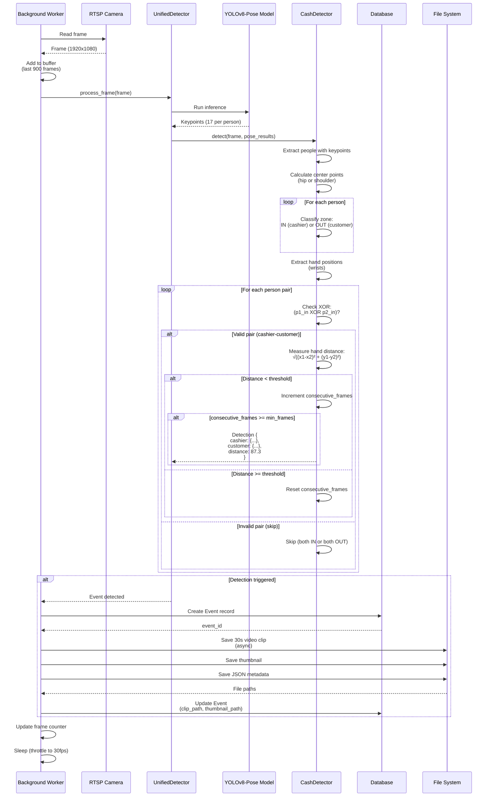
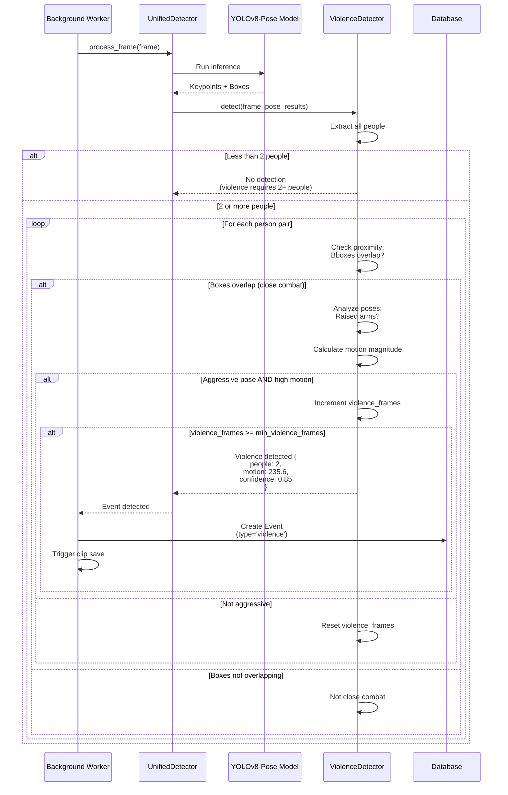
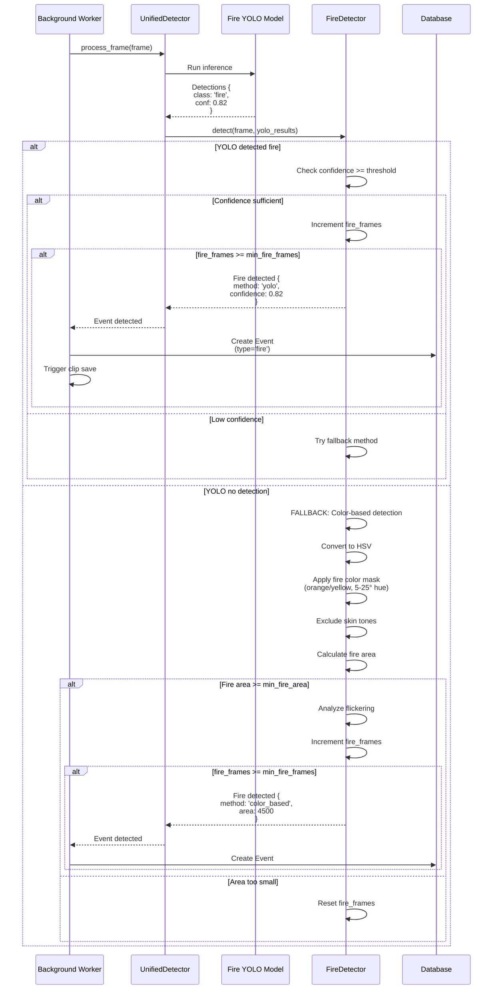
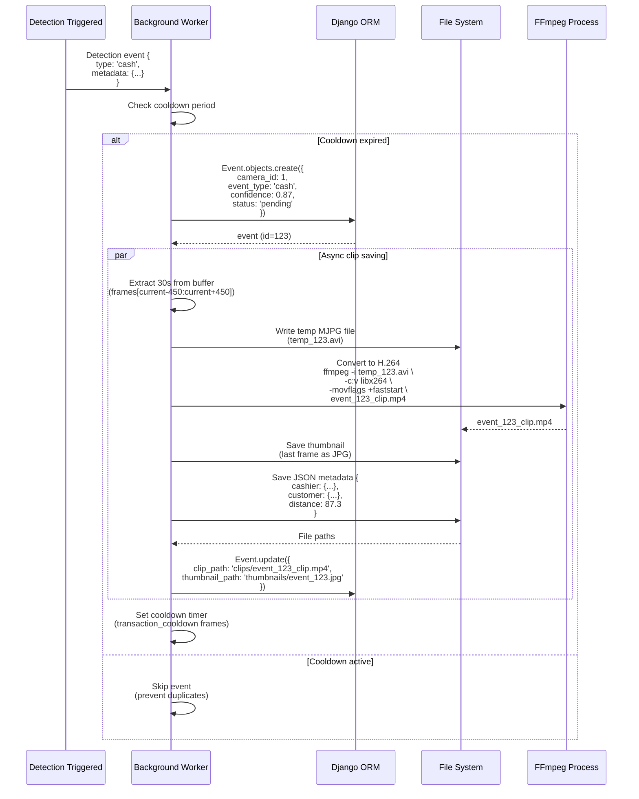
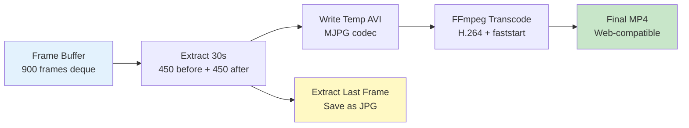
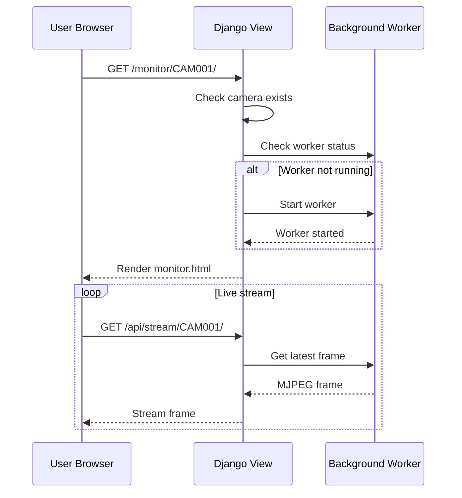
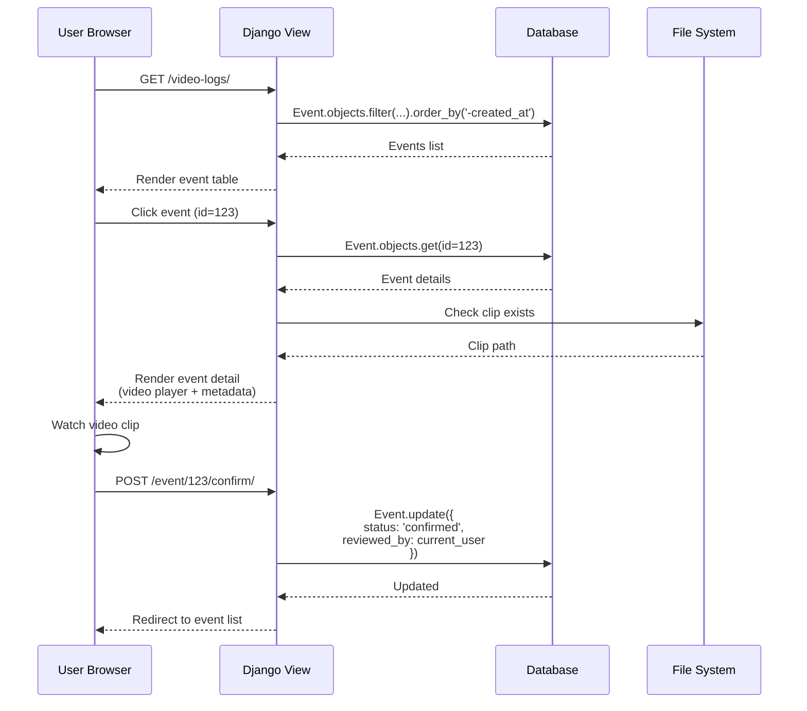
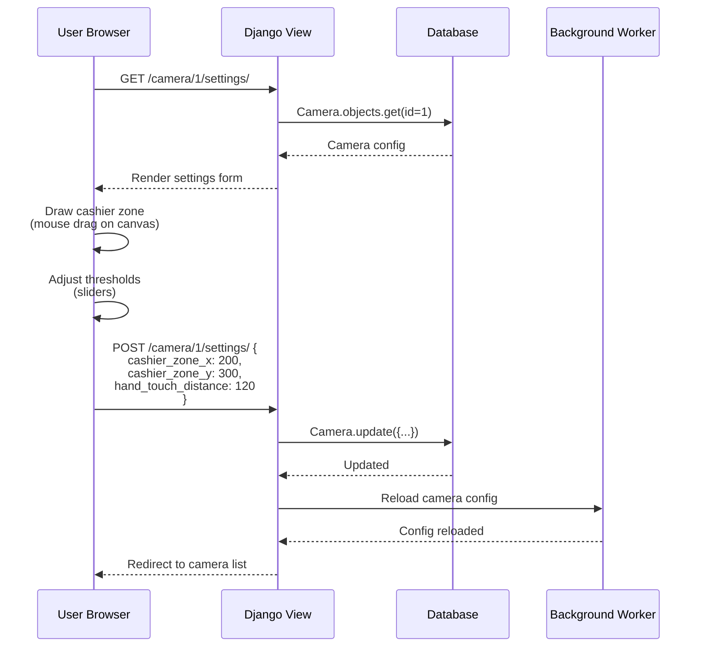

# Flows - Hotel Cash Detector

End-to-end workflows and sequence diagrams for detection processes.

## Table of Contents

1. [Cash Transaction Detection Flow](#cash-transaction-detection-flow)
2. [Violence Detection Flow](#violence-detection-flow)
3. [Fire Detection Flow](#fire-detection-flow)
4. [Event Saving Flow](#event-saving-flow)
5. [Video Clip Generation](#video-clip-generation)
6. [User Interaction Flows](#user-interaction-flows)

---

## Cash Transaction Detection Flow

### Complete Detection Sequence



### Step-by-Step Breakdown

#### 1. Frame Acquisition
- Worker reads frame from RTSP camera (TCP transport)
- Frame buffered for 30 seconds (900 frames at 30fps)

#### 2. Pose Estimation
- YOLOv8-Pose detects all people in frame
- Extracts 17 keypoints per person
- Returns keypoints with confidence scores

#### 3. Zone Classification
- Calculate person center (hip or shoulder average)
- Check if center point is inside cashier zone
- Classify: IN zone = cashier, OUT zone = customer

#### 4. Hand Position Extraction
- Extract wrist positions (keypoints 9, 10)
- Filter by confidence (>= 0.3)
- Store left and right hand coordinates

#### 5. Pair Validation (XOR)
- Check all person pairs
- **Skip** if both IN zone (cashier-cashier)
- **Skip** if both OUT zone (customer-customer)
- **Valid** if XOR: exactly ONE in, ONE out

#### 6. Distance Measurement
- Calculate Euclidean distance between hands
- Check all hand combinations (left-left, left-right, right-left, right-right)
- Compare to `hand_touch_distance` threshold

#### 7. Consecutive Frame Tracking
- Increment counter if detection valid
- Reset counter if detection lost
- Trigger event if counter >= `min_transaction_frames`

#### 8. Event Creation
- Save to database with full metadata
- Trigger async clip saving
- Generate thumbnail and JSON

---

## Violence Detection Flow

### Detection Sequence



### Key Checks

1. **Minimum 2 People**: Violence requires at least 2 people in frame
2. **Close Proximity**: Bounding boxes must overlap
3. **Aggressive Poses**: Raised arms, rapid motion
4. **High Motion**: Motion magnitude > threshold
5. **Sustained**: 15+ consecutive frames (0.5s at 30fps)

---

## Fire Detection Flow

### Detection Sequence



### Detection Methods

#### Primary: YOLO Model
- Custom-trained YOLOv8 model
- Classes: Fire (0), Smoke (2)
- Fast and accurate

#### Fallback: Color-Based
- HSV color space analysis
- Fire colors: H=5-25°, S=150-255, V=200-255
- Skin tone exclusion to prevent false positives
- Flickering analysis for motion validation

---

## Event Saving Flow

### Complete Event Lifecycle



### Cooldown Mechanism

**Purpose**: Prevent duplicate events for same transaction/incident.

**Configuration**:
- `TRANSACTION_COOLDOWN=45` frames (1.5s at 30fps)
- `VIOLENCE_COOLDOWN=90` frames (3s at 30fps)
- `FIRE_COOLDOWN=60` frames (2s at 30fps)

**Logic**:
```python
# Check cooldown
frames_since_last_event = current_frame - last_event_frame

if frames_since_last_event >= cooldown_frames:
    # Cooldown expired, allow new event
    save_event()
    last_event_frame = current_frame
else:
    # Still in cooldown, skip
    pass
```

---

## Video Clip Generation

### Frame Buffer to MP4



### Implementation

```python
def save_clip(frames, camera, event_type, event_id):
    """Save 30-second video clip from frame buffer."""

    # Step 1: Create temporary AVI with MJPG
    temp_path = f'temp_{event_id}.avi'
    fourcc = cv2.VideoWriter_fourcc(*'MJPG')
    height, width = frames[0].shape[:2]
    fps = 30

    out = cv2.VideoWriter(temp_path, fourcc, fps, (width, height))
    for frame in frames:
        out.write(frame)
    out.release()

    # Step 2: Transcode to H.264 MP4 with FFmpeg
    final_path = f'media/clips/{event_type}_{camera.id}_{timestamp}.mp4'

    subprocess.run([
        'ffmpeg', '-y', '-i', temp_path,
        '-c:v', 'libx264',      # H.264 codec
        '-preset', 'fast',      # Encoding speed
        '-crf', '23',           # Quality (18-28 typical)
        '-pix_fmt', 'yuv420p',  # Pixel format (universal support)
        '-movflags', '+faststart',  # Optimize for web streaming
        '-r', str(fps),         # Frame rate
        final_path
    ], check=True)

    # Step 3: Save thumbnail (last frame)
    thumb_path = f'media/thumbnails/{event_type}_{camera.id}_{timestamp}.jpg'
    cv2.imwrite(thumb_path, frames[-1])

    # Step 4: Save JSON metadata
    json_path = f'media/json/{event_type}_{camera.id}_{timestamp}.json'
    with open(json_path, 'w') as f:
        json.dump(metadata, f, indent=2)

    # Clean up temp file
    os.remove(temp_path)

    return final_path, thumb_path, json_path
```

### FFmpeg Parameters

| Parameter | Value | Purpose |
|-----------|-------|---------|
| `-c:v libx264` | H.264 codec | Universal browser support |
| `-preset fast` | Fast encoding | Balance speed/compression |
| `-crf 23` | Constant Rate Factor | Quality setting (lower = better) |
| `-pix_fmt yuv420p` | Pixel format | Maximum compatibility |
| `-movflags +faststart` | Move metadata | Enable progressive streaming |
| `-r 30` | Frame rate | Match source FPS |

---

## User Interaction Flows

### 1. View Live Camera Feed



### 2. Review Event



### 3. Configure Camera Settings



---

## Related Documentation

- [01 - Architecture](01-architecture.md) - System architecture and background workers
- [04 - Features](04-features.md) - Detection algorithms in detail
- [05 - Data Models](05-data-models.md) - Database schema and Event model
- [06 - Integrations](06-integrations.md) - RTSP streaming and video processing

---

**Previous**: [← 06 - Integrations](06-integrations.md) | **Next**: [08 - Deployment →](08-deployment.md)
